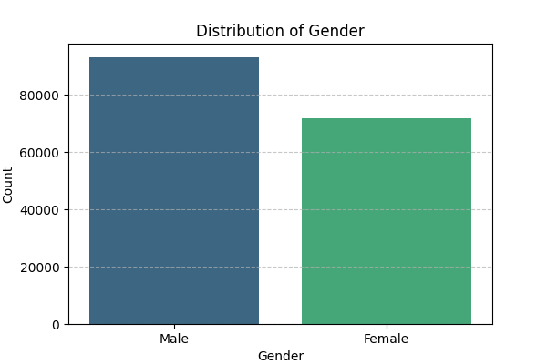

# PandasAI-Gemini - 

## Project Overview

PandasAI-Gemini is an AI-powered data analysis project that integrates Google Gemini 2.5 Flash with PandasAI.  
It allows users to query pandas DataFrames using natural language, enabling instant insights, smart visualizations, and seamless interaction without manual coding.
  
## Key Features

- **Natural Language Queries**: Interact with DataFrames using plain English prompts.  
- **Custom LLM Wrapper**: Implements a GeminiFlash class for smooth integration with PandasAI’s SmartDataframe.
- **Smart Visualization**: Automatically generates plots and charts based on user instructions.
- **Lightweight & Extensible**: Easy to extend to new datasets and analysis tasks

## Technologies Used

### Core Technologies

- Programming Language: Python (3.x)
- Libraries:
	- Pandas
	- PandasAI
	- Google Generative AI (google-generativeai)
	- Python-dotenv
	- Matplotlib

### Workflow
1. Load CSV dataset with pandas.
2. Preprocess and transform categorical variables (map Gender to numeric).
3. Use SmartDataframe with Gemini LLM to answer queries.
4. Generate text insights or visualizations directly from natural language.

## Installation and Usage

### Python Requirements
Python 3.11

1. **Clone the Repository:**
   ```bash
  git clone https://github.com/your-username/PandasAI-Gemini.git
   ```

2. **Set Up a Python Environment:**
   ```bash
   python -m venv venv
   source venv/bin/activate  # On Windows: venv\Scripts\activate
   ```

3. **Install Required Libraries:**
   ```bash
   pip install -r requirements.txt
   ```

4. **Set Environment Variables:**
	Create a .env file in the project root and add your API key:
   ```env
   GOOGLE_API_KEY=your_api_key_here
   ```
   
5. **Run the Project**

## Demo
	```python
	try:
		result = sdf.chat("plot Gender_num ( 0 is Male, 1 is Female) ")
		print("Answer:", result)
	except Exception as e:
		print("PandasAI crash:", e)
	```


## Project Structure

```
PandasAI-Gemini/
│── data/
│   ├── train.csv            # Data
├── pandasAI_prompt.ipynb    # Source code
├── requirements.txt         # Required libraries
└── README.md                
```

## Contact Me
Auther: Guan-Wei Huang (gwhuang24@gmial.com)

## License

© 2025 CivicSignal. All rights reserved.
Unauthorized use, reproduction, or distribution is prohibited without explicit permission.
